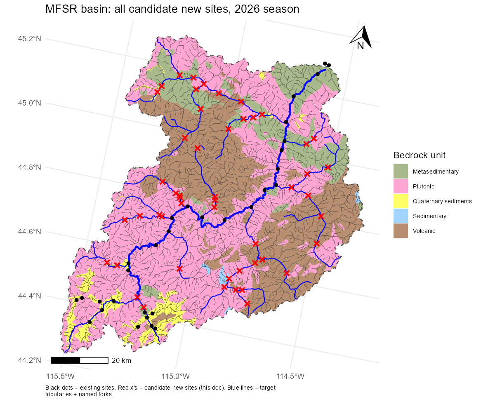
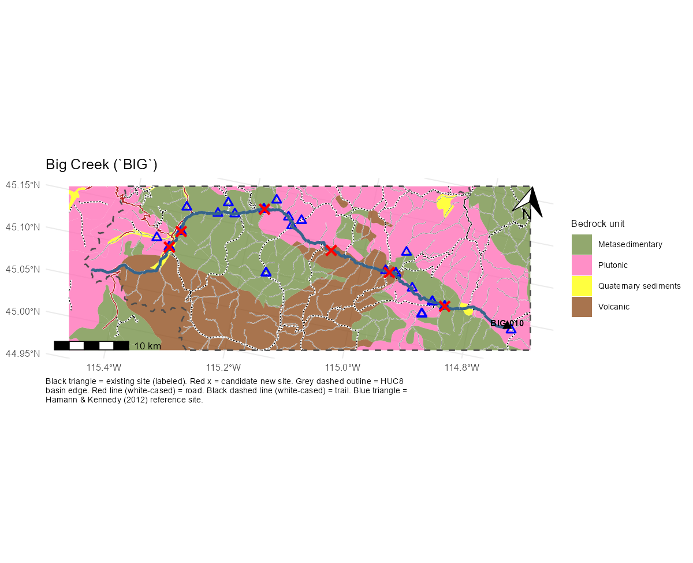
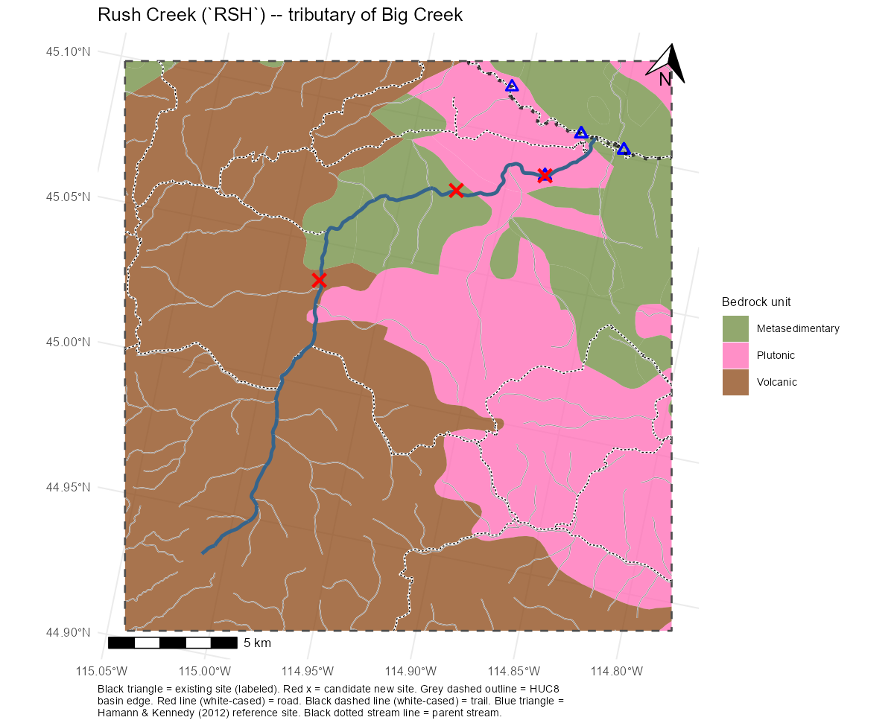
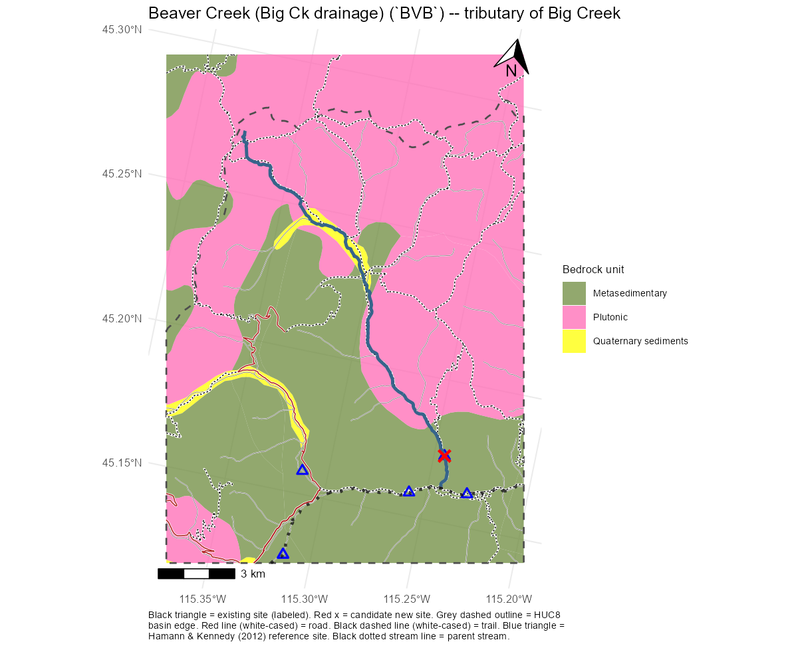
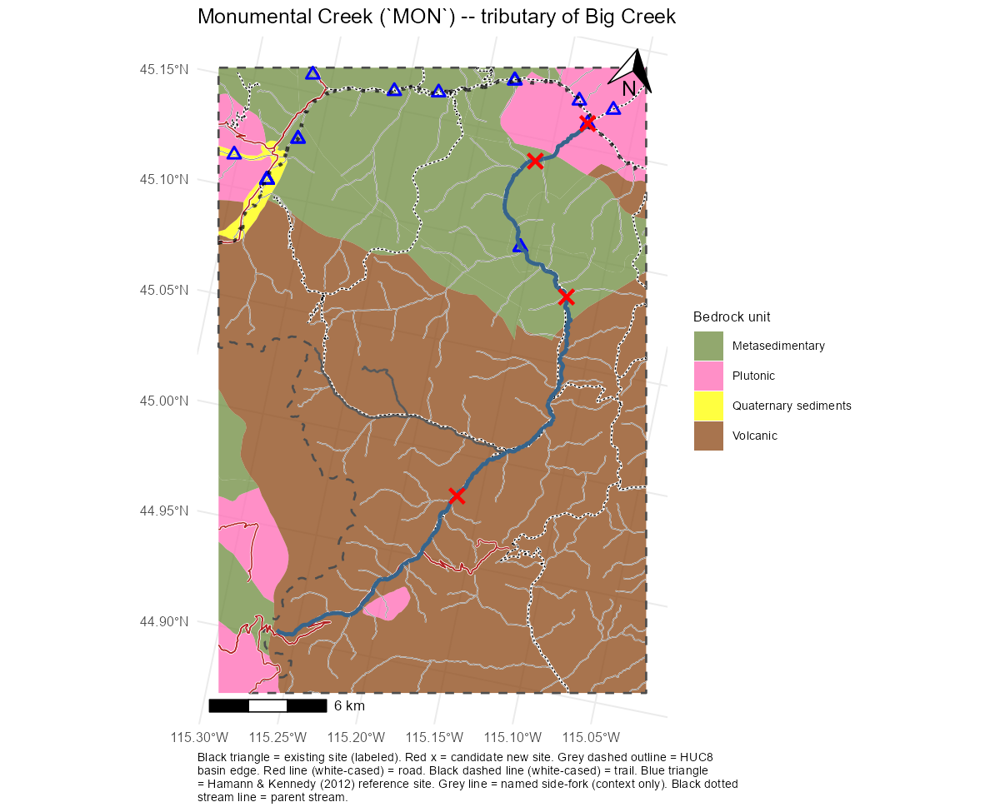
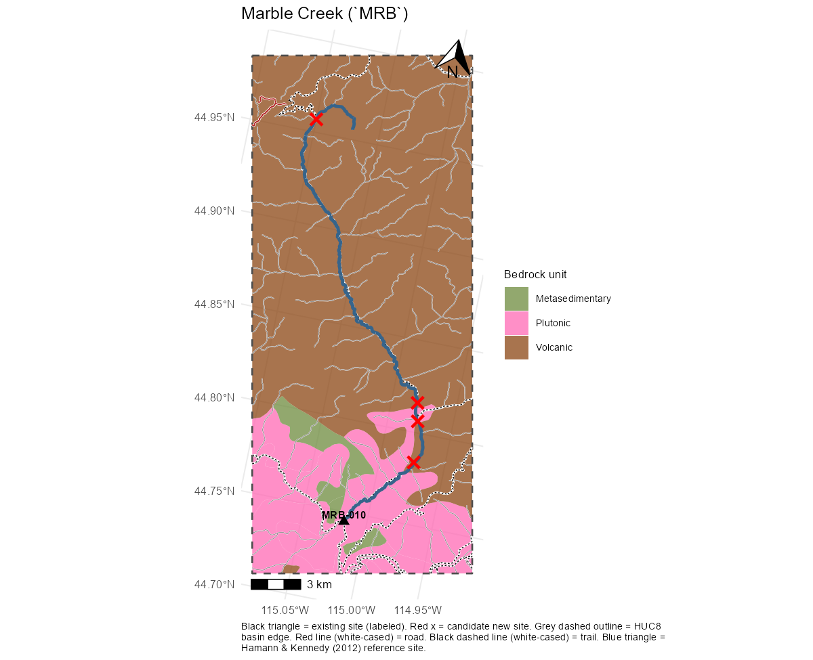
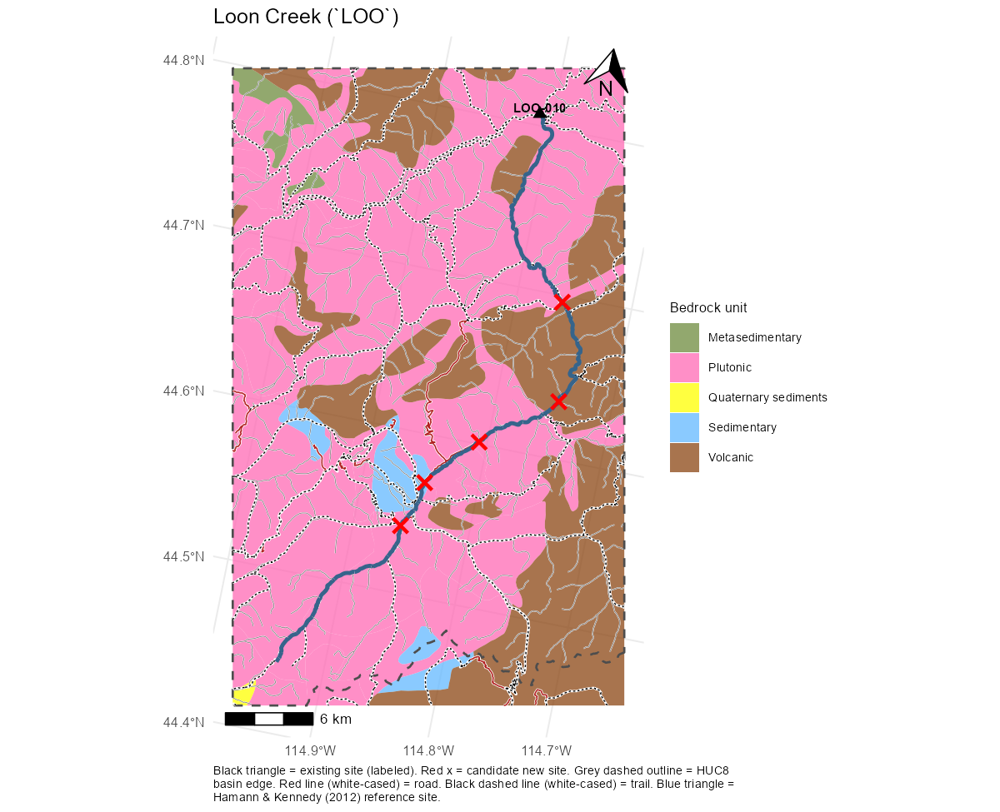
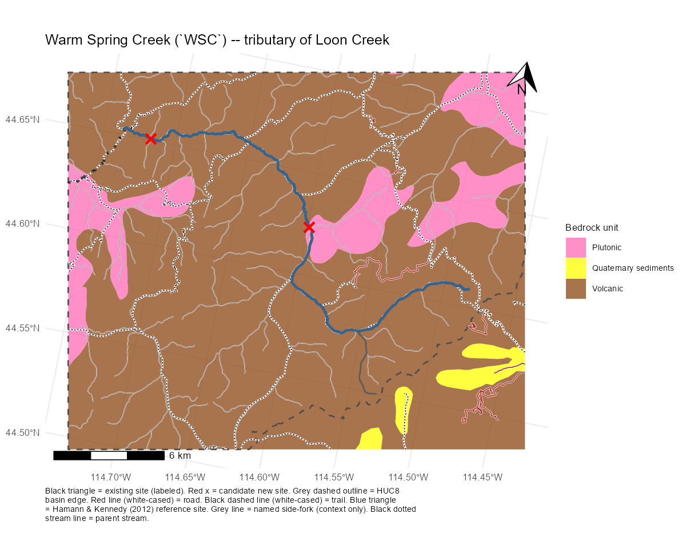
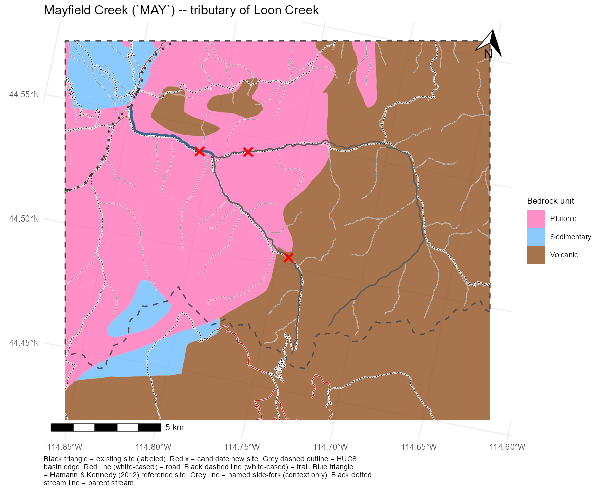
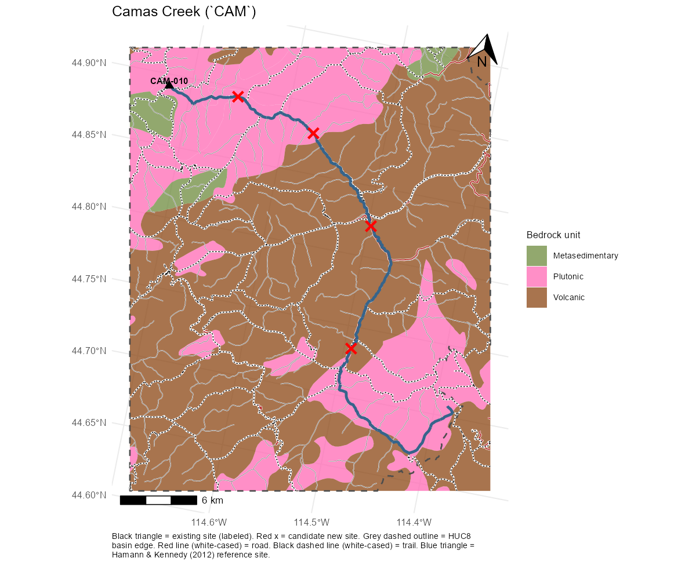

## Why we're asking you to collect these samples

We're building a strontium isotope (⁸⁷Sr/⁸⁶Sr) map of the Middle Fork Salmon River watershed. Different bedrock types (granite, volcanic rock, ancient metamorphic rock) leave a distinct, measurable chemical fingerprint in stream water — and Chinook salmon record that same fingerprint in their otoliths (ear bones) as they grow, the same way tree rings record a timeline. This lets us later trace where a given fish spent its early life just by reading its otolith chemistry. Your samples fill in geography we can't reach ourselves this season — thank you for helping with this.

Questions at any point: **Bryan Maitland**, USDA Forest Service Rocky Mountain Research Station — bryan.maitland\@usda.gov, work cell 970-837-1933.

**Note**: Treat these as "aim near," not exact GPS targets — collect wherever is safe and reachable near each point.

**Sample upstream or downstream of a contact?** Downstream, as a default. Water carries a rock unit's dissolved Sr signature only after it's had a chance to weather that rock, so a sample taken just *upstream* of a contact still reflects the *previous* (upstream) unit -- it hasn't touched the new one yet. Sampling just *downstream* lets the water pick up the new unit's contribution first. In practice "just downstream" should mean a bit past the contact rather than immediately at it, since water needs a short distance to mix across the channel width; a few hundred meters to a kilometer downstream is a reasonable rule of thumb where access allows.



## All candidate sites, 2026 season

For orientation: every site in the project this season, yours and everyone else's. Zoomed maps for your specific tributaries are in each section below, alongside the GPS points.

{width="1107"}



## Which sites you're covering

| Who | Stream | Notes |
|-----------------------|-------------------------|------------------------|
| Colden Baxter & students | Big Creek (n=6) | Most geologically diverse tributary. |
| Colden Baxter & students | Lower Rush Creek (n=1) | Near the Big Creek confluence. Remote and difficult beyond that, so just one sample. |
| Colden Baxter & students | Lower Beaver Creek (n=1) | Near the Big Creek confluence. Same logic as Rush Creek. |
| Colden Baxter & students | Lower Monumental Creek (n=2) | Both near the Big Creek confluence — one right at the confluence, one \~1 mile upstream. |
| PNF biologists | Upper Monumental Creek (n=1) | Near the trailhead. |
| PNF biologists (if able) | Middle Monumental Creek (n=1) | Only if your trip reaches this far downstream — see note below. |
| PNF biologists | Upper Marble Creek (n=1) | Near trailhead. |
| PNF biologists (if able) | Lower Marble Creek (n=3) | \~8-11 km upstream of the MFSR confluence, closely spaced. |
| Russ Thurow | Loon Creek (n=5), Warm Spring Creek (n=2), Mayfield Creek (n=3) | Collecting within the next two weeks (by \~7/23). |
| Russ Thurow (if able) | Camas Creek (n=4) | Possible September trip, hiking down the drainage to the river. |

If plans change and you end up covering different reaches than listed here, that's fine — just record the actual GPS coordinates for whatever you collect (see datasheet below) so we can place it correctly.



## Colden Baxter & students: Big Creek and Lower Rush Creek, Beaver Creek, Monumental Creek

**Big Creek candidate spots**, roughly from the `BIG-010` confluence heading upstream:

- \~8.7 km upstream (\~45.103°N, -114.846°W)
- \~19.4 km upstream (\~45.130°N, -114.950°W, volcanic rock meets valley-fill deposits)
- \~31 km upstream (\~45.14177°N, -115.0556°W, mid-drainage spatial coverage)
- \~45.9 km upstream (\~45.175°N, -115.182°W, a metamorphic/granite contact)
- \~58 km upstream (\~45.128°N, -115.314°W)
- \~61 km upstream (\~45.106°N, -115.328°W)



**Rush Creek and (Big Creek's) Beaver Creek**:

- both have an easily reachable sample spot near their mouths (Rush Creek: \~45.088°N, -114.882°W; Beaver Creek: \~45.173°N, -115.245°W)
- everything further upstream on either is remote and not worth detouring for, so just one sample from each.

{width="370"}

{width="370"}



**Lower Monumental Creek (two sites)**:

- Right at the confluence (\~45.16149°N, -115.1303°W) — this is also Hamann & Kennedy's (2012) "Big Cr. upstream of Monumental Cr." sample point, Plutonic bedrock. Easy grab-and-go from the Big Creek side.
- \~1.9 miles (3.1 km) up Monumental Creek itself (\~45.13964°N, -115.15895°W) — a real hike in, but squarely in Metasedimentary rock rather than sitting on the contact.

See the Monumental Creek note below for Payette's separate upper-drainage coverage.



## Payette NF biologists: Monumental Creek and Marble Creek

**Upper Monumental Creek**:

- (see map above) the uppermost \~30+ km of Monumental Creek sits entirely within one volcanic rock unit — no internal contact up there to specifically target, so wherever you're able to access near the trailhead is fine for a single representative sample.
- If your trip reaches down to about 13.5 km upstream of the Big Creek confluence (\~45.081°N, -115.121°W), that's the one spot where the bedrock shifts to a metasedimentary unit and a second sample there would be valuable — but only if it's on your route already, not worth a special trip.

**Marble Creek**: if you're already working Monumental Creek, there's a site near the Marble Creek trailhead worth a short trip in to collect. The lower sites \~8-11 km upstream of the MFSR confluence (three, closely spaced) will be done by Bryan if you don't get to lower Marble.



## Russ: Loon Creek, Warm Spring Creek, Mayfield Creek, Camas Creek

**Loon Creek** (from the `LOO-010` confluence heading upstream, five sites):

- \~15.8 km upstream (\~44.696°N, -114.760°W, a volcanic/granite contact)
- \~25 km upstream (\~44.635°N, -114.746°W, mid-drainage spatial coverage)
- \~32.1 km upstream (\~44.601°N, -114.807°W, approaching the sedimentary patch)
- \~34.9 km upstream (\~44.570°N, -114.846°W, sedimentary patch, downstream edge)
- \~40.4 km upstream (\~44.541°N, -114.860°W, sedimentary patch, upstream edge)



**Warm Spring Creek** (Loon Creek tributary):

- \~1.5 km upstream above Loon Creek confluence (\~44.651°N, -114.717°W)
- \~14.2 km upstream, at the midpoint of a small granite inlier (\~44.623°N, -114.599°W)



**Mayfield Creek** (Loon Creek tributary):

- \~4.2 km upstream on main trunk, below where East and West Forks join (\~44.540°N, -114.806°W)
- **West Fork Mayfield Creek**, upstream of contact (\~44.504°N, -114.744°W)
- On **East Fork Mayfield Creek** (\~44.543°N, -114.779°W)



**Camas Creek** (if you get to it, four sites):

- \~6.3 km upstream of `CAM-010`, down from Yellowjacket Creek confluence (\~44.894°N, -114.652°W)
- \~14.1 km upstream, a volcanic/granite contact (\~44.879°N, -114.571°W)
- \~23.1 km upstream, mid-drainage spatial coverage (\~44.822°N, -114.497°W)
- \~37 km upstream, the same volcanic/granite contact crossed again further up (\~44.734°N, -114.493°W)



## Collection protocol

**Materials** (we can supply a kit if you don't have these already):

- 1 L Nalgene bottle (temporary collection/hold)
- 125 mL acid-washed sample bottle (labeled)
- 60 mL syringe, luer tip
- 0.45 µm syringe filter
- Nitrile gloves
- Sharpie for labeling sample bottles
- Cool storage

**Steps**:

1.  Put on nitrile gloves. Triple rinse the collection bottle. Collect \~1 L of stream water in the Nalgene bottle, from mid-current if possible (avoid stagnant edges/backwater).
2.  Attach the syringe (no filter yet). Draw and expel water from the Nalgene through the syringe 3 times to rinse it.
3.  Rinse the 125 mL sample bottle: expel \~2-5 mL from the syringe onto the ground first (this clears the filter's storage residue once attached — see step 4), then add \~10 mL of sample water to the bottle, cap, shake vigorously, and dump. Repeat 3 times.
4.  Refill the syringe with water. Attach the 0.45 µm syringe filter to the syringe. **Do not let the filter touch anything except the plastic packaging it came in** — no hands, no ground, no bottle threads.
5.  Push water through the filter into the 125 mL sample bottle until you have \~100 mL (as needed, remove filter carefully, refill the syringe from the Nalgene, re-attach the filter, and continue pushing water).
6.  Cap the bottle immediately and label it (see below).
7.  Keep the bottle cool (not frozen) from here until it reaches a vehicle — see the next section for how to do that on a multi-day backcountry trip with no cooler immediately at hand.



## Keeping samples cool in the backcountry

Most of these sites are a multi-day backpacking or camping trip from the nearest vehicle, so "on ice" from step 7 above usually isn't available right away. The goal is to keep bottles cool (not frozen) from collection until they reach a vehicle, then a cooler, then the lab fridge.

**Why it matters**: per the ICP-MS lab, there are two reasons to keep samples cool. First, to prevent algae growth — algae doesn't fractionate strontium itself, but it can make the column chemistry (the lab prep step that isolates Sr from everything else in the sample) messier. Second, heat accelerates the sample leaching plastic from the bottle itself; acid-washing the bottle first (already part of our kit — see Materials above) reduces this but doesn't eliminate it.

**How strict this actually needs to be**: there's no hard temperature threshold, and the lab understands the realities of backcountry fieldwork. The main failure mode to avoid is *visible* algae growth in the bottle. If an insulated cooler setup is too much to carry, overnight stream cooling (below) on its own is a workable compromise — it doesn't need to be paired with the in-transit cooler if that's not practical for your trip.

Recommended approach:

1.  **Overnight — cache in a stream or spring.** Submerge bottles in a mesh or dive bag, weighted and secured to a rock or branch, in a shaded side stream or spring near camp. Idaho backcountry streams run \~4–10°C even in summer — more effective and more stable overnight than a melting ice pack would be by day 2-3, and on its own is enough to avoid the main concern (algae growth) if that's as far as your trip allows.
2.  **While hiking — minimize heat gain rather than actively refrigerate.** Pack bottles in the coolest, shadiest part of your pack (not the sun-exposed lid, not against your back). A layer of spare clothing adds insulation; a wetted bandana or wet stuff sack around the bottles gives free evaporative cooling in Idaho's dry mountain air.
3.  **In-transit protection: an insulated lunch box + ice sheet.** It's semi-rigid (protects bottles from crushing) and pairs with a flat, refreezable ice sheet instead of bulky block ice.
4.  **Fallback**: frozen drinking-water bottles work as the ice source instead of dedicated ice packs, so the cooling element does double duty as trail water once it melts.



## Labeling and datasheet

**On the bottle**: just the site code and date — e.g. `BIG-NEW1  7/15`. Everything else (GPS, collector, time, notes) goes on the datasheet, not the bottle; the less writing exposed to water, the less that can smear.

Bottles sitting in a cooler with condensation, or jammed in wet gear for days, will smear a plain Sharpie label eventually — it's not the ink, it's water getting under it. Main fix:

- Let the Sharpie dry a few minutes, then burnish a strip of clear packing tape over the whole label. That seal is what stops the smearing, not writing it twice.

Use a site code in the format `[STREAM]-[POSITION]` — use the existing code from the if you're at an established site (e.g. `BIG-010`), or make up a placeholder like `BIG-NEW1` if you're at a new spot and let Bryan assign the real code afterward. The placeholder codes are also found in the partner data spreadsheet.

**Datasheet**: one row per site you're expected to hit, site code and stream already filled in. Bring a copy in a ziplock and fill in date, GPS, collector, time, and notes as you go. If you end up somewhere not on the sheet, add a row with a placeholder code.

A photo of the site (looking upstream and downstream) is a nice bonus but not required.

## Getting samples back to us

Once you're back at a vehicle, keep samples cool (see above) until you can either hand them off in person or ship them. If shipping, pack with an ice source in a cooler or insulated box and contact Bryan first to arrange timing and a shipping address — samples sitting in transit too long can be affected, so we'll coordinate the fastest path back.

Thanks again for helping expand this dataset — every tributary sample directly improves what we can say about where these fish come from.
